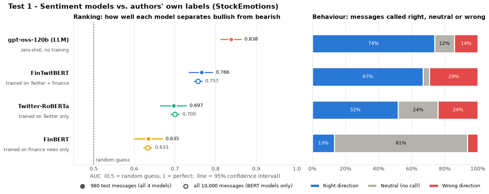
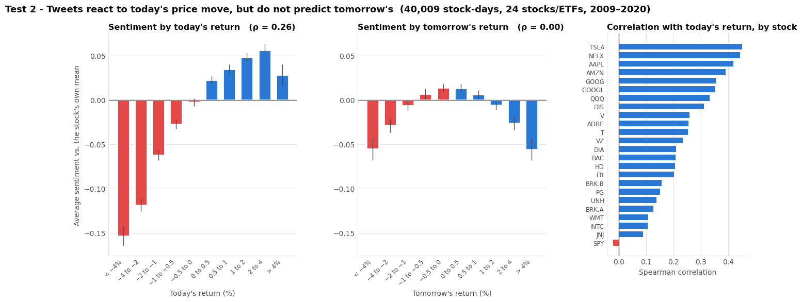
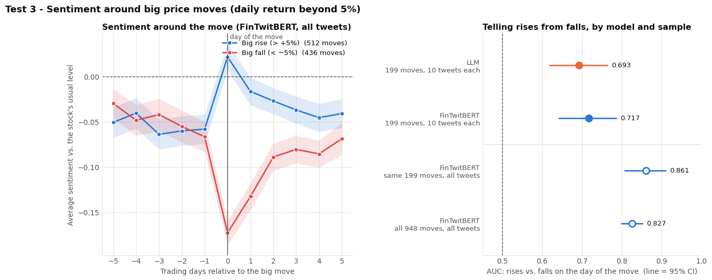
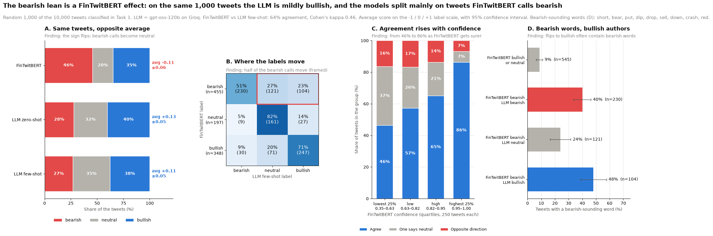
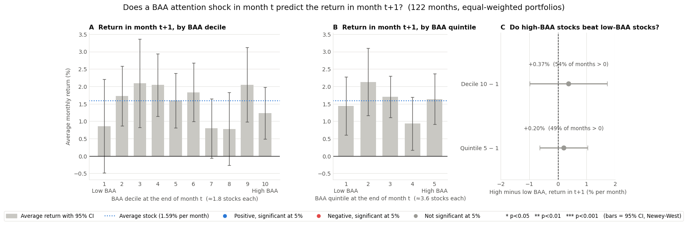
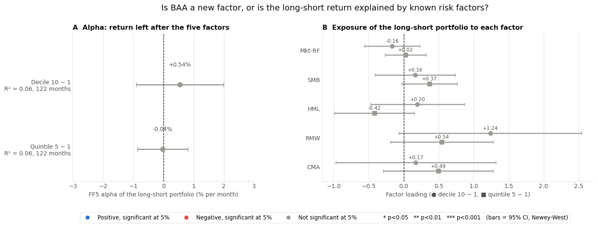

# Social-Media Attention as an Equity Factor: NLP on 5.6 Million StockTwits Posts

An end-to-end text-as-data project in Python. It cleans 5.6 million StockTwits messages on 25 US stocks and ETFs (2009–2020), benchmarks four sentiment models against human-labelled data (three transformer models and a large language model), and then builds a firm-level measure of **abnormal investor attention** to test whether it predicts stock returns, before and after Fama–French five-factor risk adjustment.

> **Status:** completed team project (4 authors), originally developed as coursework in an MSc finance course at Bocconi University. See [Authors](#authors-and-contributions), [How the notebook was produced](#how-the-notebook-was-produced) and [Disclaimer](#disclaimer).
>
> **Related projects:** [Testing the CAPM on US Equities](https://github.com/ceciliaalocicero/capm-empirical-tests-sp500) · [Markowitz Out-of-Sample Test](https://github.com/ceciliaalocicero/markowitz-out-of-sample-test)

---

## Research questions

1. Which sentiment model reads financial social-media posts best: finance-trained, Twitter-trained, both, or a general-purpose LLM?
2. Does StockTwits sentiment anticipate returns, or react to them?
3. Can unusual attention to a stock be turned into a return-predicting factor?

## Key findings

| # | Finding | Evidence |
|---|---------|----------|
| 1 | **Domain fit matters more than domain label.** On 10,000 human-labelled StockTwits messages, FinTwitBERT (finance + social media) separates bullish from bearish best (AUC 0.757), ahead of Twitter-RoBERTa (0.700) and FinBERT (0.633), which calls about 80% of messages neutral. A zero-shot LLM (gpt-oss-120b) does better still: AUC 0.838 vs 0.766 for FinTwitBERT on the same 980 messages. | StockEmotions benchmark, bootstrap 95% CIs |
| 2 | **Sentiment reacts to prices; it does not predict them.** Daily abnormal sentiment correlates with same-day returns (Spearman 0.265) but not with next-day returns (−0.003). On days with moves above 5%, sentiment separates rises from falls (AUC 0.83 over 947 moves), but in the five days before a move it says nothing about its direction. | 25 tickers, stock-days with ≥ 5 posts |
| 3 | **Model choice can flip a headline result.** On the same 1,000 posts, FinTwitBERT's average tone is −0.11 and the LLM's is +0.11 (agreement 64%, Cohen's κ 0.46). Most of the gap comes from words such as "short", "puts" and "bear" being read as bearish regardless of the author's position. Relative findings (index ETFs less positive than single stocks; tone stable over time) hold under both models. | FinTwitBERT vs LLM zero-/few-shot |
| 4 | **Raw attention is mostly a popularity contest.** The top 1% of users write 46.7% of posts, and five tickers take about 74% of mentions every year. A breadth-based abnormal attention measure (BAA: users capped at one per stock-month, multi-ticker posts split, compared with the stock's own 12-month median) rotates across stocks: 23 of 25 tickers reach the BAA top 5 in at least one year. | 122 reliable months, 2010–2020 |
| 5 | **No evidence that abnormal attention predicts returns.** High-minus-low BAA earns +0.37% per month for deciles (t = 0.54) and +0.20% for quintiles (t = 0.47). The long-short portfolio's FF5 alpha is +0.54% (t = 0.73) and its five-factor R² is about 0.06. With only 15–19 matched S&P 500 stocks per month, this is an absence of evidence with low statistical power, not proof of no effect. | Monthly sorts, Fama–MacBeth, FF5, Newey–West SEs |

---

## Selected results

**Benchmarking sentiment models against human labels**



**Sentiment vs. same-day and next-day returns**



**Sentiment around large price moves (event study)**



**FinTwitBERT vs. LLM on the same posts**



**Next-month returns of BAA-sorted portfolios**



**Is the BAA long-short portfolio a new factor? (FF5 alpha and loadings)**



All 27 figures are in [`figures/`](figures/).

---

## Data

| Dataset | Content | Access | Included? |
|---------|---------|--------|-----------|
| StockTwits messages | 6.48M rows / 5.56M unique posts on 25 tickers, Jul 2009 – Jul 2020 (text, timestamp, numeric user ID, message ID) | Course-provided scrape | **No**: platform content and user identifiers |
| StockEmotions | 10,000 StockTwits posts labelled bullish/bearish by their authors | Downloaded at runtime from the authors' GitHub repository | No (fetched by the notebook) |
| Daily prices | Adjusted closes for the tweeted tickers | Yahoo Finance via `yfinance`, at runtime | No |
| CRSP daily returns | S&P 500 constituents, 2007–2023 | WRDS (licensed) | **No** |
| Fama–French 5 factors | Monthly Mkt-RF, SMB, HML, RMW, CMA, RF | Ken French Data Library, at runtime | No |

See [`data/README.md`](data/README.md) for file names, expected formats and the cached intermediate files.

---

## Methodology

**1. Data preparation.** Merge two archives; remove 73,148 exact duplicates; keep 845,165 cross-listed rows in a separate tweet–ticker table. Clean HTML entities and links; keep tickers, emojis and capitalisation because they carry sentiment. Detect the Sep–Dec 2017 collection gap (21–29% of normal volume) and exclude it from factor construction.

**2. Sentiment model selection.**
- Benchmark Twitter-RoBERTa, FinBERT, FinTwitBERT and gpt-oss-120b (zero-shot, via the Groq API) on StockEmotions, using AUC with bootstrap confidence intervals, macro F1 and balanced accuracy.
- Validate on own data: same-day vs next-day return correlations, and an event study around ±5% moves.
- Choose FinTwitBERT for the full sample (scalable, reproducible, probabilistic outputs) and keep the LLM as a robustness check.

**3. Sentiment diagnostics.** Ambiguity check (margin between the top two probabilities), leave-one-stock-out analysis, FinTwitBERT vs LLM agreement on 1,000 posts, and an emoji tokenisation check (FinTwitBERT's tokenizer maps the 15 most common emojis to `[UNK]`).

**4. Text processing.** Emoji and emoticon normalisation, finance-aware stopwords (directional words and negations kept), protected option vocabulary ("calls", "puts"), multi-word expressions ("buy_the_dip", "short_squeeze"), lemmatisation, vocabulary statistics, and word clouds of frequent vs distinctive words.

**5. Attention measures.** Three monthly candidates:
- raw relative attention (share of the month's mentions);
- **broad abnormal attention (BAA):** user-capped and 1/k-weighted share, relative to the stock's median over its previous 12 valid months;
- user-level sentiment disagreement.

They are compared on cross-correlation, persistence and rankings.

**6. Return tests.**
- Point-in-time PERMNO matching to CRSP.
- Monthly BAA deciles and quintiles, equal-weighted, with attention measured in month t and returns in month t+1.
- High-minus-low spreads with Newey–West (3-lag) standard errors.
- Fama–MacBeth slopes.
- FF5 abnormal returns and residuals.
- FF5 regression of the long-short portfolio.

---

## Repository structure

```
stocktwits-attention-factor/
├── README.md
├── LICENSE
├── requirements.txt
├── .gitignore
├── notebooks/
│   └── stocktwits_sentiment_attention.ipynb   # full analysis, committed with outputs
├── figures/                                   # 27 PNG charts taken from the notebook outputs
├── data/
│   └── README.md                              # data sources, expected files, cached intermediates
└── references/
    └── README.md
```

## Technologies

Python · pandas · NumPy · Hugging Face Transformers (PyTorch) · Groq API (gpt-oss-120b) · NLTK · emoji · scikit-learn · statsmodels · Matplotlib · seaborn · WordCloud · yfinance · CRSP via WRDS

## How the notebook was produced

The notebook was developed by four people over several sessions and is committed **with the outputs of those original runs**; it was not re-executed for publication. Since submission it has been reorganised and lightly edited for readability; methods and results are unchanged. Raw rows showing user identifiers have been removed from the outputs, and @usernames in example posts are masked as `@USER`.

Full re-execution needs the raw StockTwits archives, the CRSP extract, internet access, and the cached model outputs listed in [`data/README.md`](data/README.md). The largest of these, FinTwitBERT scores for all 5.56M posts, was computed in a separate long-running job outside the notebook. The scoring script is not included.

## Reproducing the analysis

```bash
git clone https://github.com/ceciliaalocicero/stocktwits-attention-factor.git
cd stocktwits-attention-factor
python -m venv .venv
.venv\Scripts\activate            # macOS/Linux: source .venv/bin/activate
pip install -r requirements.txt
```

1. Place the data and cached files as described in [`data/README.md`](data/README.md).
2. For new LLM scores, set a Groq API key as the environment variable `GROQ_API_KEY`. It is requested at runtime and never stored in the notebook. Cached LLM scores are reloaded without a key.
3. Open `notebooks/stocktwits_sentiment_attention.ipynb` and run the cells in order.

## Limitations

- **Sentiment measurement.** FinTwitBERT has a bearish keyword bias on this data; tone-based measures inherit it. The LLM scored only samples (980 benchmark posts, 1,000 sample posts, 2,000 event-study posts) because of API rate limits.
- **Benchmark contamination.** StockEmotions is public, so an LLM may have seen it during pre-training; the LLM's benchmark advantage may be overstated.
- **Small cross-section for return tests.** Only 15–19 S&P 500 stocks per month can be matched (TSLA was not an S&P 500 member during the sample), so deciles hold about 1.8 stocks.
- **Next-day returns** are taken from the next stock-day *with posts*, not strictly the next trading day. For heavily discussed stocks these coincide; for thinly discussed ones the gap can be longer (see the note in the notebook).
- **In-sample FF5 betas.** Abnormal returns use full-sample factor loadings.
- **Data quality.** The ticker label is not always reliable (cross-listing), there is a four-month collection gap in 2017, and 2020 is a partial year.
- **Not a trading strategy.** No transaction costs, and monthly horizons only; any attention effect may operate at daily or weekly horizons.

## Authors and contributions

Team project by **Cecilia Lo Cicero, Sara Pulidori, Alissa Sharuda and Nico Visentin**.

Repository prepared and maintained by **Cecilia Lo Cicero**. *My contributions: I worked across all stages of the project jointly with the team: data cleaning, sentiment-model benchmarking and diagnostics, text processing, construction of the attention measures, and the return and Fama–French tests.*

Developed as coursework for *Finance with Big Data* (MSc, Bocconi University). The assignment framework was provided by the course; the analysis, extensions and write-up are the team's own.

## References

- Antweiler, W., & Frank, M. Z. (2004). Is all that talk just noise? The information content of internet stock message boards. *Journal of Finance*, 59(3), 1259–1294.
- Araci, D. (2019). FinBERT: Financial sentiment analysis with pre-trained language models. arXiv:1908.10063.
- Barber, B. M., & Odean, T. (2008). All that glitters: The effect of attention and news on the buying behavior of individual and institutional investors. *Review of Financial Studies*, 21(2), 785–818.
- Da, Z., Engelberg, J., & Gao, P. (2011). In search of attention. *Journal of Finance*, 66(5), 1461–1499.
- Fama, E. F., & French, K. R. (2015). A five-factor asset pricing model. *Journal of Financial Economics*, 116(1), 1–22.
- Fama, E. F., & MacBeth, J. D. (1973). Risk, return, and equilibrium: Empirical tests. *Journal of Political Economy*, 81(3), 607–636.
- Lee, J., Youn, H. L., Poon, J., & Han, S. C. (2023). StockEmotions: Discover investor emotions for financial sentiment analysis and multivariate time series. arXiv:2301.09279.
- Loureiro, D., Barbieri, F., Neves, L., Espinosa Anke, L., & Camacho-Collados, J. (2022). TimeLMs: Diachronic language models from Twitter. *ACL 2022 System Demonstrations*.
- Newey, W. K., & West, K. D. (1987). A simple, positive semi-definite, heteroskedasticity and autocorrelation consistent covariance matrix. *Econometrica*, 55(3), 703–708.
- Models: [`cardiffnlp/twitter-roberta-base-sentiment-latest`](https://huggingface.co/cardiffnlp/twitter-roberta-base-sentiment-latest), [`ProsusAI/finbert`](https://huggingface.co/ProsusAI/finbert), [`StephanAkkerman/FinTwitBERT-sentiment`](https://huggingface.co/StephanAkkerman/FinTwitBERT-sentiment), `openai/gpt-oss-120b` via Groq.

## Disclaimer

This is an educational project. It does not constitute investment advice. All results are historical. No StockTwits content, user identifiers or licensed data are redistributed in this repository.

## License

Code is released under the [MIT License](LICENSE). Data, model weights and third-party datasets remain under their providers' terms.
